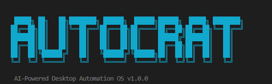

<p align="center">
  <h1 align="center">⚡ Autocrat CLI</h1>
  <p align="center">
    <strong>An AI-powered desktop automation OS that writes its own plugins, controls your PC from your phone, and asks permission before touching the internet.</strong>
  </p>
  <p align="center">
    <a href="https://github.com/Autocrat2005/Autocrat/blob/main/LICENSE"></a>
    <a href="https://www.python.org/downloads/"></a>
    <a href="https://ollama.com/"></a>
    
    
    
  </p>
</p>

<p align="center">
  
</p>

---

## What is Autocrat?

Autocrat is a modular, AI-powered command-line automation system. It turns natural language into executable system actions — window management, file operations, process control, web scraping, and more — all from a single unified interface.

The killer feature: **Autocrat can write, validate, and load new plugins at runtime using a local LLM**. Tell it what you need in plain English, and it builds the tool on the spot. If the generated code tries to call a domain you haven't approved, the system pauses and asks for your permission — just like Android asks for location access.

---

## Features

### Plugin Generation (core builder)

- **Natural language to plugin**: Describe what you want and the LLM generates a fully structured Nexus plugin
- **AST validation sandbox**: Every generated file is parsed, scanned for unsafe patterns (eval, exec, ctypes, raw sockets, etc.), and structurally verified before it ever runs
- **Hot-swap loading**: New plugins are imported and registered into the live engine with no restart needed
- **Auto-heal**: If a generated plugin crashes, the error traceback is fed back to the LLM which patches and reloads it automatically
- **Persistence**: Generated plugins survive restarts and are auto-discovered and reloaded on boot

### Dynamic Network Permissions

When the AST scanner detects that a generated plugin wants to contact an external domain (via httpx, requests, urllib, etc.) that isn't in the allowlist, the system **pauses the load** and presents an interactive security prompt:

```
[SECURITY] Generated plugin 'weatherFetcher' is requesting network access to: api.openweathermap.org

Choose an option:
  [1] Allow Once       → grant permission weatherFetcher once
  [2] Allow Always     → grant permission weatherFetcher always
  [3] Block & Delete   → grant permission weatherFetcher block
```

- **Allow Once**: Permits the load for this session only
- **Allow Always**: Adds the domain to the config permanently
- **Block & Delete**: Removes the generated file entirely

This means the system stays fully autonomous without ever making unauthorized network calls.

### Remote Control via Ngrok

Expose Autocrat's web server through ngrok and control your PC from your phone, tablet, or any browser:

1. Start the server: `python main.py --web`
2. Tunnel it: `ngrok http 9000`
3. Hit the ngrok URL from your phone's browser

See [ngrok setup guide](ngrok_setup.md) for the full walkthrough.

### 17 Built-In Plugins (160+ commands)

| Plugin                | What it does                                                              |
| --------------------- | ------------------------------------------------------------------------- |
| **windowManager**     | Focus, minimize, maximize, resize, snap windows                           |
| **processController** | List, kill, monitor processes                                             |
| **fileOps**           | Create, read, write, delete, search files and folders                     |
| **keyboardMouse**     | Type text, hotkeys, mouse clicks, scrolling                               |
| **screenIntel**       | Screenshots, OCR, screen region capture                                   |
| **appLauncher**       | Open apps by name                                                         |
| **clipboard**         | Copy, paste, history                                                      |
| **systemInfo**        | CPU, RAM, disk, battery, network stats                                    |
| **volumeDisplay**     | Volume up/down/mute, display brightness                                   |
| **shellExecutor**     | Run shell commands with output capture                                    |
| **taskScheduler**     | Schedule recurring commands                                               |
| **workflowEngine**    | Chain multi-step workflows, LLM-generated workflows                       |
| **smartActions**      | Context-aware compound actions                                            |
| **powerTools**        | Shutdown, restart, sleep, hibernate, lock                                 |
| **intelligence**      | Proactive nudges, context probes, system health                           |
| **cometWebAgent**     | Headless browser automation with Playwright (ReAct agent)                 |
| **coreBuilder**       | The meta-plugin that generates, validates, loads, and heals other plugins |

### AI Pipeline

Commands go through a 4-stage pipeline:

1. **Regex parser** — fast, exact pattern matching
2. **ML Brain** — sentence-transformer embeddings (all-MiniLM-L6-v2) for semantic intent classification
3. **Local LLM** — Ollama (qwen2.5-coder:3b) for dynamic understanding and code generation
4. **Conversational fallback** — general knowledge answers when no action matches

### Safety Architecture

- Blocked imports: ctypes, winreg
- Blocked functions: eval, exec, os.system, subprocess.Popen, shutil.rmtree, raw open
- Destructive action confirmation: shutdown, restart, kill, delete all require explicit approval
- Domain allowlist for web navigation and API calls
- Dynamic permission prompts for generated plugin network access

---

## Setup

### Prerequisites

- Python 3.10+
- [Ollama](https://ollama.com/) with `qwen2.5-coder:3b` pulled
- Windows 10/11 (system automation plugins use Win32 APIs)

### Installation

```bash
git clone https://github.com/Autocrat2005/Autocrat.git
cd Autocrat

python -m venv .venv
.venv\Scripts\activate       # Windows
# source .venv/bin/activate  # Linux/Mac

pip install -r requirements.txt
```

### Pull the LLM model

```bash
ollama pull qwen2.5-coder:3b
ollama serve
```

### Run

```bash
# CLI mode
python main.py

# Web server mode (for remote control and phone access)
python main.py --web
```

The web server listens on `http://127.0.0.1:9000` by default.

---

## Usage Examples

### Generate a plugin from your phone while commuting

You're on the bus and realize you need a tool to batch-rename files for tonight's project. Pull out your phone, hit the ngrok URL, and type:

```
build plugin that batch renames all files in a given folder by adding a prefix and timestamp
```

By the time you reach your desk, the plugin is generated, validated, and loaded. Ready to use.

### Scaffold an entire project remotely

```
workflow generate create a python project folder called myAutoProject with an init file, a main.py that prints hello world, and a requirements.txt
```

The workflow engine generates the folder structure, writes the files, and confirms. All from a single command sent from your phone.

### Build plugins that hit external APIs

```
build plugin that fetches current weather for a given city and returns temperature humidity and description
```

The system generates the plugin, detects the `wttr.in` URL in the code, and pauses:

```
⚠️ [SECURITY] Plugin 'weather_fetcher' requests access to: wttr.in
  [1] Allow Once   [2] Allow Always   [3] Block & Delete
```

You type `grant permission weather_fetcher always` and the domain is permanently added to the config. The plugin loads instantly.

```json
{
  "success": true,
  "result": "🌍 Weather in Ballard Estate, India:\n  🌡️  30°C (86°F) — feels like 34°C\n  ☁️  Smoke\n  💧 Humidity: 43%\n  💨 Wind: 21 km/h WNW"
}
```

### Chain complex automations

```
workflow generate extract the top trending repo from github.com/trending, then create a folder called trendingProject and write a README.md with the repo name and description
```

### Headless web scraping

```
react plan Go to codeforces.com/contests, find the most recent Div 2 contest, extract the contest name and id
```

The cometWebAgent launches a headless Playwright browser, navigates, extracts data, and returns structured results.

---

## Folder Structure

```
Autocrat/
├── nexus/
│   ├── core/
│   │   ├── brain.py          # ML intent classifier (sentence-transformers)
│   │   ├── config.py         # YAML config manager with auto-defaults
│   │   ├── engine.py         # Central command router and plugin manager
│   │   ├── events.py         # Event bus for plugin communication
│   │   ├── learner.py        # Behavioral learning (time, chain, frequency)
│   │   ├── logger.py         # Structured logging
│   │   ├── parser.py         # Regex command parser (200+ patterns)
│   │   └── plugin.py         # Base plugin class
│   ├── plugins/
│   │   ├── core_builder.py   # Meta-plugin that generates other plugins
│   │   ├── comet_web_agent.py # Headless browser automation (Playwright)
│   │   ├── workflow_engine.py # Multi-step workflow orchestration
│   │   ├── generated/        # Auto-generated plugins live here
│   │   └── ... (14 more)
│   ├── integrations/
│   │   └── telegram_bot.py   # Telegram remote control
│   └── web/
│       ├── server.py         # FastAPI HTTP server
│       └── static/           # Web dashboard (HTML/CSS/JS)
├── workflows/                # Saved workflow YAML files
├── logs/                     # Runtime logs
├── screenshots/              # Screen captures
├── nexus_config.yaml         # Master configuration
├── pyproject.toml            # Python packaging config
├── main.py                   # Entry point
├── requirements.txt          # Python dependencies
└── test_brain.py             # Tests
```

---

## Configuration

All settings live in the config YAML:

```yaml
ai:
  llm_backend: local_ollama
  local_model: qwen2.5-coder:3b
  local_base_url: http://127.0.0.1:11434

system:
  safe_mode: false

safety:
  confirm_destructive: true
  web:
    allowlist_domains:
      - github.com
      - codeforces.com
      - wttr.in
      - localhost
```

Domains are added automatically when you choose "Allow Always" through the dynamic permission prompt. No manual editing needed.

---

## How Dynamic Permissions Work

```
User:    "build plugin that fetches crypto prices from coinbase API"
           │
           ▼
     ┌──────────────┐
     │  LLM generates│
     │  plugin code  │
     └──────┬───────┘
            │
            ▼
     ┌──────────────┐
     │ AST Validator │─── syntax check
     │               │─── safety scan (blocked patterns)
     │               │─── structure verify (NexusPlugin subclass)
     └──────┬───────┘
            │
            ▼
     ┌──────────────────┐
     │ Network URL Scan  │─── detects "api.coinbase.com"
     │                    │─── not in allowlist!
     └──────┬────────────┘
            │
            ▼
     ┌──────────────────────────────────────────┐
     │  [SECURITY PROMPT]                        │
     │  Plugin wants access to api.coinbase.com  │
     │                                           │
     │  [1] Allow Once                           │
     │  [2] Allow Always (persist to YAML)       │
     │  [3] Block & Delete                       │
     └──────┬────────────────────────────────────┘
            │
            ▼ (user picks 2)
     ┌──────────────┐
     │  Hot-load     │─── importlib dynamic import
     │  into engine  │─── register commands
     └──────────────┘
            │
            ▼
        Plugin ready to use
```

---

## Contributing

Contributions welcome! See [CONTRIBUTING.md](CONTRIBUTING.md) for guidelines on adding plugins, parser patterns, and submitting PRs.

## Roadmap

- [ ] Linux / macOS support (replace Win32 APIs with cross-platform alternatives)
- [ ] Voice control via faster-whisper
- [ ] Plugin marketplace (share generated plugins with the community)
- [ ] Multi-agent orchestration (agents that spawn sub-agents)
- [ ] VS Code extension for inline command execution
- [ ] Persistent memory / context across sessions

## License

MIT License. See [LICENSE](LICENSE) for details.

---

<p align="center">
  <strong>Built by <a href="https://github.com/Autocrat2005">Autocrat2005</a></strong><br>
  If this project is useful, consider giving it a ⭐
</p>
